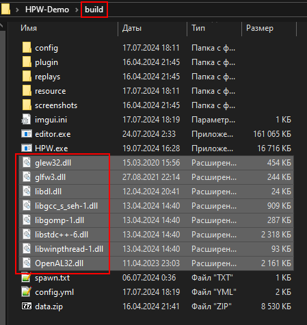
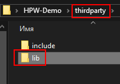

### Подготовка к сборке для Windows:
Я пользуюсь компилятором MinGW-W64 i686-ucrt-mcf-dwarf 13.2.0 из [WinLibs](https://winlibs.com/). На MSVC сборка не тестировалась.

Зависимости собраны в .dll файлы и запакованы в архив. Скачать их можно в [разделе релизов](https://github.com/HPW-dev/HPW-Demo/releases). Если хотите собрать зависимости самостоятельно, то скачайте зависимости [из списка](../thirdparty_versions.txt) и соберите их.

- DLL файлы из hpw_dlls_v#.#.#.zip нужно распаковать **в папку [build/bin/](../build/bin/)**.\
Если у вас **32-битная система**, то берите файлы **из папки x32** в архиве:\

- Папку lib/ из hpw_libs_v#.#.#.zip нужно распаковать в папку [thirdparty/](../thirdparty/).\
Если у вас 32-битная система, то берите файлы из папки x32 в архиве:\


### Подготовка к сборке для Linux:
При сборке в Линуксе, зависимости докачайте самостоятельно через ваш пакетный менеджер (ищите devel или dev пакеты, например glew-devel).
_(Static-версия и контейнеры в .appimage ещё не готовы)_

**Требуемые пакеты: GCC/Clang, GLEW, GLFW3, OpenAL-soft, YAML-cpp.**\
Если у вас Wayland, то нужно качать **glfw-wayland**.

### Сборка игры
Ваш компилятор **должен поддерживать C++23**, например [MinGW-W64](https://winlibs.com/) _(GCC 15.2.0)_. \
Для сборки так же потребуется [Python3](https://www.python.org/) _(не старее 3.13.7)_.

_Команды на скачивание и сборку игры:_
```
git clone --depth=1 https://github.com/HPW-dev.HPW-Demo HPW-Demo
cd HPW-Demo
python build.py
```
