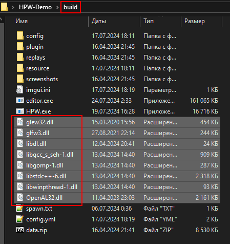
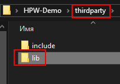

# Как собрать для Windows:
Я пользуюсь компилятором MinGW-W64 из [WinLibs](https://winlibs.com/). Потребуется **[Python](https://www.python.org/)**. **На MSVC сборка не поддерживается**. 

Зависимости собраны в .dll файлы и запакованы в архив. Скачать их можно в [разделе релизов](https://github.com/HPW-dev/HPW-Demo/releases). Если хотите собрать зависимости самостоятельно, то скачайте зависимости [из списка](../thirdparty_versions.txt) и соберите их.

- DLL файлы из hpw_dlls_v#.#.#.zip нужно распаковать **в папку [build/bin/](../build/bin/)**.\
Если у вас **32-битная система**, то берите файлы **из папки x32** в архиве:\

- Папку lib/ из hpw_libs_v#.#.#.zip нужно распаковать в папку [thirdparty/](../thirdparty/).\
Если у вас 32-битная система, то берите файлы из папки x32 в архиве:\


Переходите в разде [Сборка игры из исходников](#Сборка-игры-из-исходников)

# Как собрать для Linux:
Потребуется GCC, **Clang и musl не поддерживаются**. Static-версия и контейнеры в .appimage ещё не готовы. Минимальный поддерживаемый стандарт для сборки **C++23**. Потребуется **[Python](https://www.python.org/)**.

При сборке в Линуксе, **зависимости докачайте самостоятельно** через ваш пакетный менеджер (ищите devel или dev пакеты, например glew-devel). 
**Требуемые пакеты:** GCC/Clang, GLEW, GLFW3, OpenAL-soft, YAML-cpp. Если у вас **Wayland**, то нужно качать **glfw-wayland**.

# Сборка игры из исходников
_Команды для скачивания и сборки игры:_
```
git clone --depth=2 https://github.com/HPW-dev/HPW-Demo
cd HPW-Demo
python builder
```

Для дополнительных настроек: ```python builder -h```
