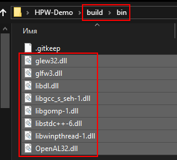

### Как собрать для Windows:
Я пользуюсь компилятором MinGW-W64 i686-ucrt-mcf-dwarf 13.2.0 из [WinLibs](https://winlibs.com/). На MSVC сборка не тестировалась.

Зависимости собраны в .dll файлы и запакованы в архив. Скачать их можно в [разделе релизов](https://github.com/HPW-dev/HPW-Demo/releases). Если хотите собрать зависимости самостоятельно, то скачайте зависимости [из списка](../thirdparty%20versions.txt) и соберите их.

- DLL файлы из hpw_dlls_v#.#.#.zip нужно распаковать **в папку [build/bin/](../build/bin/)**.\
Если у вас **32-битная система**, то берите файлы **из папки x32** в архиве:\

- Папку lib/ из hpw_libs_v#.#.#.zip нужно распаковать в папку [thirdparty/](../thirdparty/).\
Если у вас 32-битная система, то берите файлы из папки x32 в архиве:\


### Как собрать для Linux:
**Static-версия и контейнеры в .appimage ещё не готовы**.\
При сборке в Линуксе, зависимости докачайте самостоятельно через ваш пакетный менеджер (ищите devel или dev пакеты, например glew-devel). 

**Требуемые пакеты: GCC/Clang, GLEW, GLFW3, OpenAL-soft, YAML-cpp.**\
Если у вас Wayland, то нужно качать **glfw-wayland**.

### Сборка игры
**Минимальный поддерживаемый стандарт для сборки = C++23**.\
Ваш компилятор должен поддерживать этот стандарт.

Для сборки потребуется [система сборки SCons](https://scons.org/) и [Python3](https://www.python.org/) (python2 не подойдёт).\
Команда на скачиваение SCons через pip: ```py -m pip install --user scons```

#### Команды на скачивание и сборку игры:
```
git clone --depth=1 https://github.com/HPW-dev/HPW-Demo
cd HPW-Demo
python "script/build-game-release.py"
```
