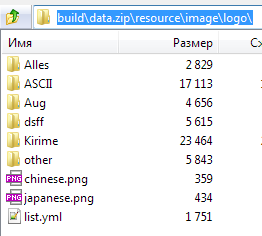
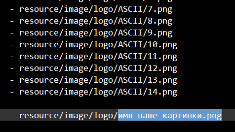

## Логотипы
Чтобы добавить свой логотип в стартовое меню, скопируйте *.png* изображение в **build/data.zip/resource/image/logo/**\

Затем откройте в этой же папке файл list.yml и добавьте туда строку с путём к картинке\

Рисуйте логотипы с названием игры или с символами из игры. Картинка сама растянется, если она маленькая. Логотип каждый раз разный, чтобы его поменять нажмите F4 или выйдете и зайдите обратно в меню.
