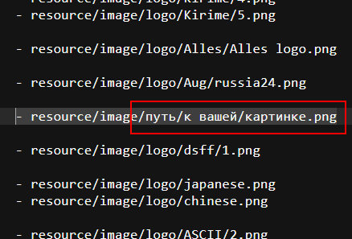

## Логотипы
Чтобы добавить свой логотип в стартовое меню, скопируйте *.png* изображение в **build/data.zip/resource/image/logo/**\

Затем откройте в этой же папке файл list.yml и добавьте туда строку с путём к картинке\

На логотипах должно быть название игры или символика игры. Если картинка маленькая, она сама увеличится в меню.
Картинки в меню каждый раз разные.
